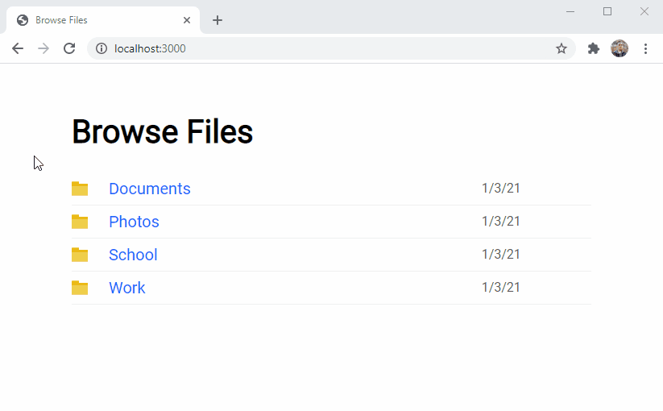

# Webfile

Serve static files in a directory with a web user interface.



## Installation

Make sure you have [Node.js](https://nodejs.org) installed.

Clone this repository

```
git clone https://github.com/travishorn/webfile.git
```

Or [download it as a zip file](https://github.com/travishorn/session-timeout/archive/master.zip) and unzip into your preferred directory

Change into the directory

```
cd webfile
```

Install dependencies

```
npm install
```

## Configuration

Edit the configuration options in `webfile.config.json`

**port**

The port on which the server will listen. For example, if this is set to `3000` you will be able to access the web user interface at http://localhost:3000.

**serveDirectory**

Files and subdirectories in this directory will be served via the web user interface.

**title**

The text that will appear in the title bar and the header of the page.

**truncateNamesAt**

If a file or directory name is too long, it may cause the page to look bad. Names over this value will be truncated. An ellipse will be appended and the full name will be viewable by hovering over the truncated name.

## Deployment

Start the server

```
npm start
```

Once started a message will appear indicating where the server is listening.

## License

The MIT License

Copyright 2021 Travis Horn

Permission is hereby granted, free of charge, to any person obtaining a copy of this software and associated documentation files (the "Software"), to deal in the Software without restriction, including without limitation the rights to use, copy, modify, merge, publish, distribute, sublicense, and/or sell copies of the Software, and to permit persons to whom the Software is furnished to do so, subject to the following conditions:

The above copyright notice and this permission notice shall be included in all copies or substantial portions of the Software.

THE SOFTWARE IS PROVIDED "AS IS", WITHOUT WARRANTY OF ANY KIND, EXPRESS OR IMPLIED, INCLUDING BUT NOT LIMITED TO THE WARRANTIES OF MERCHANTABILITY, FITNESS FOR A PARTICULAR PURPOSE AND NONINFRINGEMENT. IN NO EVENT SHALL THE AUTHORS OR COPYRIGHT HOLDERS BE LIABLE FOR ANY CLAIM, DAMAGES OR OTHER LIABILITY, WHETHER IN AN ACTION OF CONTRACT, TORT OR OTHERWISE, ARISING FROM, OUT OF OR IN CONNECTION WITH THE SOFTWARE OR THE USE OR OTHER DEALINGS IN THE SOFTWARE.
